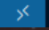

## Franka Emika e Moveit! com o Gazebo

Simulação do robo [Franka Emika](https://franka.de/) no Gazebo com o Moveit!

# Pacotes instalados

- franka_description - Arquivos urdf, xacro que descrevem o robo
- panda_moveit_config - Configurações do Moveit! para o robo
- franka_moveit_sim - Pacote com os scripts de simulação do robo

---

# Como executar:

Você pode executar em sua máquina local ou via GitHub Codespaces. Se for executar no seu computador é necessária a preparação do ambiente local, caso contrário vá para a seção ["Tutorial Via GitHub Codespaces"](#tutorial-via-github-codespaces).

## Preparação do ambiente na máquina local - git + docker + vscode

1. Verifique se o git está instalado

    ```bash
    git --version
    ```

    1.1 - Se não estiver instalar:

    ```bash
    sudo apt install git
    ```

2. Baixar o repositorio em sua máquina local:

    ```bash
    git clone https://github.com/NURIA-IFSP/LabVir_moveit_Franka_Lab1.git
    ```

3. Abrir o vscode no diretório do projeto:

    ```bash
    code LabVir_moveit_Franka_Lab1
    ```

4. Garanta que o docker esteja instalado e rodando:

    ```bash
        docker --version
    ```

5. Se não tiver, instalar o docker:

    [Docker Installation Guide](https://docs.docker.com/get-started/get-docker/)

6. Instale a extensão remote - developement: workspace, no vscode:

    - No menu de extensões do VsCode Ctrl + Shift + X procure por: Remote - Development: Workspace

## Execução do container no vscode

1. Clique no botão de play no canto inferior esquerdo do vscode:
    

2. Clique em "Reopen in Container"

3. Aguarde o container ser iniciado, o vscode irá reiniciar e abrir novamente. (Isso deve levar alguns minutos)

## Abra o ambiente de desenvolvimento no seu browser

1. Abra o terminal PORTS do vscode com o atalho: Ctrl + Shift + P - Forward a Port

2. Clique na primeira porta que estará mapeada no endereço:  <http://localhost:6080>

3. O ambiente XFCE4 deverá abrir no seu browser

4. Se desejar, ajuste a resolução para o seu monitor clicando no canto superior esquerdo do ambiente XFCE4 e selecionando "Display Settings"

5. Clique no botão para estender a exibição para a tela inteira - atalho: Ctrl + Shift + F12

## Execução Via GitHub Codespaces

Na execução via github Codespaces você não precisará instalar nada em seu computador, terá apenas que ter uma conta no github.

1. Acesse o repositório do projeto no github:
    [https://github.com/NURIA-IFSP/LabVir_moveit_Franka_Lab1](https://github.com/NURIA-IFSP/LabVir_moveit_Franka_Lab1)
    - Clique no botão "Code" e selecione "Codespaces"
    - O ambiente começará a ser montado no Codespaces (isso pode levar alguns minutos)

2. Feito isso abra o ambiente de desenvolvimento no seu browser, conforme explicado anteriormente e siga os mesmos passos.

3. Avisos Importantes para simulação usando Codespaces:
    - Após a execução do ambiente você deverá clicar no botão "Stop" para encerrar o ambiente.
    - A execução de ambientes de desenvolvimento é cobrada pelo github, havendo um limite atual de 60 horas de execução por mês, ou 180 horas por mês para usuários com acesso premium. Estudantes e professores podem ter o limite aumentado.


## Execução das simulações

1. Verificação do robô no Rviz

```bash
    roslaunch panda_moveit_config demo.launch
```

Na aba planning escolha algumas posições preé-definidas e clique em Plan e Execute para executar a trajetória.


2. Verificação do robô no Gazebo

Em um terminal execute:
```bash
    roslaunch panda_moveit_config gazebo.launch
```
Isso irá abrir o Gazebo e carregar o Franka Emika.

Num outro terminal:
```bash
    rosrun rqt_joint_trajectory rqt_joint_trajectory 
```

Selecione o controlador e o grupo e clique em "Start"

Ao movimentar as juntas no rqt_joint_controller o robô deve se movimentar no Gazebo.

3. Verificação do robô no Gazebo no ambiente simulado LabWorld2

Em um terminal execute:
```bash
    roslaunch franka_moveit_sim franka_gazebo.launch
```

Deverão abrir duas janelas. Uma do Simulador Gazebo e outra do Rviz.
__Atenção:__ o simulador Gazebo pode demorar alguns minutos para abrir. Tenha paciência.

Na janela do Rviz será possível definir uma posição para o robô que irá se movimentar no ambiente simulado.